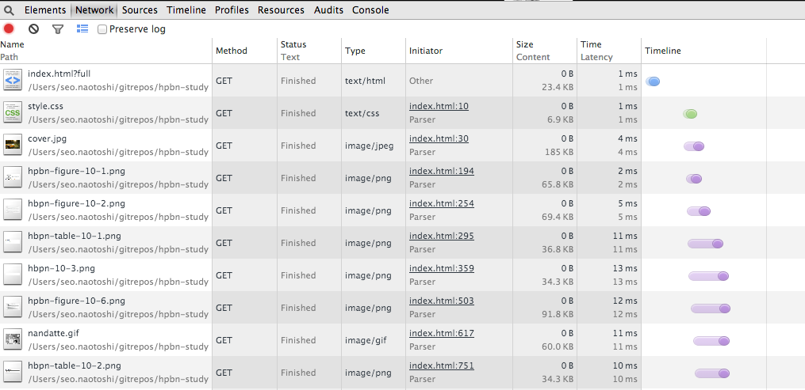

% header  
author: Naotoshi Seo
title: ハイパフォーマンスブラウザネットワーキング輪読会 第10章
cover: cover.jpg

% slide

# 10章 Web パフォーマンス入門

10章では Web パ フォーマンス最適化におけるエンドツーエンドの状況を大局的に眺める

* Web パフォーマンスにおけるレイテンシと帯域幅の影響
* HTTP に課される TCP の制約
* HTTP プロトコルの機能とその欠点
* Web アプリケーショントレンドとパフォーマンス要件
* ブラウザの制約と最適化

# 10.1 ハイパーテキスト、Web ページ、Web アプリケーション(1)

* Web の進化。3 つの異なるレベル
1. **ハイパーテキストドキュメント。**
基本的なフォーマットとハイパーリンクを付与したプレーンテキスト
2. **Web ページ。**
画像や動画などのハイパーメディアリソースのサポート。
インタラクティブなものではない。
3. **Web アプリケーション。**
JavaScript の追加と、後に起こった DHTML(Dynamic HTML)と ajax による革命。
インタラクティブな Web アプリケーション

# 10.1 ハイパーテキスト、Web ページ、Web アプリケーション(3)

* HTTP 0.9
  * 単一ドキュメントのリクエストで構成
  * ハイパーテキスト
  * 単一のドキュメント、単一の TCP 接続、そして接続終了
  * チューニングは、単一の HTTP リクエストの最適化で十分

# 10.1 ハイパーテキスト、Web ページ、Web アプリケーション(4)

* HTTP 1.0/1.1
  * Web ページの登場
  * ドキュメントとその従属リソー スの配信
  * HTTP1.0 は HTTP メタデータ(ヘッダ)の考えを導入
  * HTTP1.1 でキャッシュ制御、キープアライブなどの機能強化
  * パフォーマンスの指標がドキュメントのロード時間からページロード時間(PLT)に
  ※ PLT: ブラウザで onloadイベントが発生するまでの時間

# 10.1 ハイパーテキスト、Web ページ、Web アプリケーション(5)

* Web アプリケーション
  * マークアップが基本構造を定義
  * スタイルシートがレイアウトを定義
  * スクリプトがインタラクティブなアプリケーションを構築
  * PLT でも十分とはいえない指標になってしまった

# 10.1 ハイパーテキスト、Web ページ、Web アプリケーション(6)

* PLTに加えて、アプリケーションに特有の問題にも注目する必要性。
* アプリケーション特有のベンチマークと評価基準の定義が必要
  * アプリケーションのローディングプロセスにおける各マイルストーン
  * 最初のユーザインタラクションまでの時間
  * ユーザがエンゲージすべきインタラクション項目
  * ユーザごとのエンゲージメントとコンバージョン率

# コラム：DOM、CSSOM、そして JavaScript (1)

ブラウザがドキュメント構文の解析やレイアウトを行い、そしてスクリプトのパイプラインがドキュメントを画面に表示させるプロセス


# コラム：DOM、CSSOM、そして JavaScript (2)

1. HTMLドキュメントの構文解析 == **DOM(Document Object Model)**を構築
2. DOM 構築と並行して、スタイルシートに記述されたルールとリソースから **CSSOM(CSS Object Model)** も構築
3. 組み合わせられて「レンダーツリー」 を生成
4. これで画面をレイアウトするための十分な情報を取得できたことに

# コラム：DOM、CSSOM、そして JavaScript (3)

1. DOM 構築は JavaScript が実行されるまで先に進むことができない
2. JavaScript は CSSOM が利用可能になるまで実行できない == CSS にブロックされる
3. レンダリングまでの時間」は、マークアッ プ、スタイルシート、そして JavaScript の間の依存関係を解決する時間に左右される
4. 「スタイルシー トをページ先頭に、スクリプトはページ末尾に」というベストプラクティス
5. レンダリングとスクリプト実行はスタイルシートによってブロックされま す。CSS をなるべく早く用意する必要がある

# 10.2 モダンWebアプリケーションの解剖学(1)

平均的なWebアプリケーションは、1MB以上のサイズで、
約100の従属リソース、15の異なるホストから配信。
トレンドは右肩あがり。


# 10.2 モダンWebアプリケーションの解剖学(2)

* デスクトップアプリケーションと異なり、Web アプリケーションには独立したインストールプロセスは必要ない
* 逆にいうと、Web アプリケーションではユーザが訪問するたびに「インストール」のプロセスを行っている
* インストールプロセスとはつまり、リソースのダウンロード、DOM と CSSOM の構築、そして JavaScript の実行
* 数百ミリ秒以内の「インストール」が必要
* 期待されている高速 Web 体験を提供しなければならない

# 10.2.1 スピード、パフォーマンス、そして人間の知覚(1)

* 1 秒を過ぎるとユーザの作業の流れを断ち切ってしまい、
* 10 秒が過ぎると、タスクをやめてしまう


# 10.2.1 スピード、パフォーマンス、そして人間の知覚(2)

* DNS ルックアップ、TCP ハンドシェイク、そし て Web ページリクエストに通常かかるいくつかのパケット往復時間を合計
* すると 1,000 ミリ秒というレイテンシの「予算」は、ネットワークオーバーヘッドだけで、すべてではないにせよ、 その大半が簡単に消化されてしまう
* [Jakob Nielsen の Userbility Engineering](http://www.amazon.com/Usability-Engineering-Jakob-Nielsen/dp/0125184069) と [Steven Seow の Designing and Engineering](http://www.amazon.com/Designing-Engineering-Time-Psychology-Perception/dp/0321509188) を皆読むべき

# コラム: Web パフォーマンスを貨幣価値に換算

* スピードは機能である
* Web パフォーマンスが貨幣価値に直接換算できるという調査結果
* 例) Bing 検索ページににおける 2,000 ミリ秒の遅延はユーザあたりの売上高を 4.3% も減らした

# 10.2.2 リソースのウォーターフォールチャートを分析する(1)

* [http://www.webpagetest.org/](http://www.webpagetest.org/)
  * DNS Lookup
  * Initial Connection (TCPハンドシェイク、TLSネゴシエーション)
  * Time to First Byte (最初のデータが返ってくるまで)
  * Content Download (データ全てがダウンロードされるまで)


# 10.2.2 リソースのウォーターフォールチャートを分析する(2)

* Waterfall Chart
  * [webpagetest - https://github.com](http://www.webpagetest.org/result/140616_TJ_QAD/)
  * [webpagetest - http://www.mbga.jp](http://www.webpagetest.org/result/140616_P2_Q4A/)
  * Start Render - すべてのリソースのダウンロードよりも前に発生
  * Document Complete - (ドキュメント準備完了) イベントも、いくつか残したまま発生

# 10.2.2 リソースのウォーターフォールチャートを分析する(3)

* Web パフォーマンス指標
  * レンダリング時間
  * ドキュメント準備完了
  * 最後のリソース取得終了
* どれが重要かはそのアプリによる
* フロントエンド - ウォーターフォールチャート分析と最適化
* バックエンド -  サーバレスポンス時間とネットワークレイテンシ

# 10.2.2 リソースのウォーターフォールチャートを分析する(4)

* Connection View
  * [webpagetest - https://github.com](http://www.webpagetest.org/result/140616_TJ_QAD/)
  * [webpagetest - http://www.mbga.jp](http://www.webpagetest.org/result/140616_P2_Q4A/)
  * ウォーターフォールチャート以上の情報がないように見えるが？？？
  * 帯域幅使用率チャート(BandwidthIn)
    * Bandwitdth を MAX で使えている時間は少ない

# 10.3 パフォーマンスの柱:演算、レンダリング、ネットワーク(1)

* Web プログラムの実行、3 つの主要なタスク
  1. リソースの取得
  2. ページレイアウトとレンダリング
  2. JavaScript の実行
* レンダリングとスクリプトの実行モデルはシングルスレッド、イ ンターリーブ型
* 同時並行してDOM操作できない

# 10.3 パフォーマンスの柱:演算、レンダリング、ネットワーク(2)

* JavaScript の実行とレンダリングパイプラインの最適化
  * レンダリングとスクリプト実行のランタイムをどのように協調させるか
*   ブラウザのリソース取得がネット ワークによって制限されている状態ではあまり効果がない

# 10.3.1 より大きい帯域幅は(あまり)効果なし

* Web ブラウジングで は、パケット往復によるレイテンシが制限要素


# 10.3.2 パフォーマンスのボトルネックとしてのレイテンシ

* レイテンシがパフォーマンスのボトルネック
* 帯域幅を3.9Mbpsから1Gbpsに拡大するよりも、RTTを150ミリ秒から100ミリ秒に短縮できるほうが効果あり
* SPDY はさらに、パケット往復の数を減らすためにプロトコルの改善を測っている

# 10.4 人工的テストとリアルユーザでのパフォーマンス計測(1)

* アプリケーションによって異なる指標
* 人工的に計測したデータとリアルユーザで計測したデータ
* 人工的テスト
  * 制御された計測環境下で行われるテスト
  * パフォーマンステストスイート
  * ロードテスト
  * 監視スクリプトのアクセスログを取るなど

# 10.4 人工的テストとリアルユーザでのパフォーマンス計測(2)

* 人工的テストでは不十分
  * 実際に発生するユーザのナビゲーションパターンを再現するのは難しい。
  * ユーザのキャッシュ状態によってパフォーマンスが変化する
  * ルート上に存在するプロキシやキャッシュサーバによってパフォーマンスが変化 する
  * クライアントハードウェア
  * ブラウザの種類やバージョンの新旧
  * 実際の接続のように、常に変化する帯域幅とレイテンシ

#  RUM(Real-User Measurement)

* W3C Performance Group が用意したAPI
  * Navigation Timing API
  * Resource Timing API
  * User Timing API

# Navigation Timing API(1)

```js
> JSON.stringify(performance.timing, null, " ")
"{
 "loadEventEnd": 1402937208542,
 "loadEventStart": 1402937208541,
 "domComplete": 1402937208541,
 "domContentLoadedEventEnd": 1402937207548,
 "domContentLoadedEventStart": 1402937207527,
 "domInteractive": 1402937207527,
 "domLoading": 1402937207080,
 "responseEnd": 1402937207239,
 "responseStart": 1402937207060,
 "requestStart": 1402937206760,
 "secureConnectionStart": 1402937206714,
 "connectEnd": 1402937206760,
 "connectStart": 1402937206714,
 "domainLookupEnd": 1402937206714,
 "domainLookupStart": 1402937206714,
 "fetchStart": 1402937206711,
 "redirectEnd": 0,
 "redirectStart": 0,
 "unloadEventEnd": 0,
 "unloadEventStart": 0,
 "navigationStart": 1402937206711
}"
```

# Navigation Timing API(2)


# Navigation Timing API デモ

* このページの Ajax で Navigation Timing を HTTP POST
* [Fluentd の in_http プラグインでデータを受け取りちょっと加工して GrowthForecast にポスト](https://github.com/sonots/fluentd-navigation-timing-sample)

しようと思ったけど、Github Pages からクロスドメイン ajax できなくて
めんどくさくなってやめました ^^;

# Navigation Timing API デモ

* [http://yuroyoro.hatenablog.com/entry/2012/10/02/213340](http://yuroyoro.hatenablog.com/entry/2012/10/02/213340)
* ブックマークレット (rawgit.com 化済み)

javascript:(function(){var s=document.createElement('script');var head=document.getElementsByTagName('head')[0];var done=false;s.charset='UTF-8';s.language='javascript';s.type='text/javascript';s.src='https://rawgit.com/yuroyoro/nvtl-bookmarklet/master/navigation_timeline.js';head.appendChild(s);})();

# Resource Timing API

* Chrome の Developer Tool でみてるコレの情報をとれる標準API



# User Timing API

* Elapsed Time を計測できるAPI

```js
performance.mark('start1');
// something to measure
performance.mark('end1');

performance.measure('duration1', 'start1', 'end1');
```

* あれ、今までできなかったの？ => 追記: nano sec で取れるようになったのが新しいとのこと


# RUM(Real-User Measurement)

* いつの間にかクライアントサイドのパフォーマンス計測ができる時代になっていた。


# RUM(Real-User Measurement)

ブラウザのサポート状況 [http://caniuse.com/#search=navigation%20timing%20api](http://caniuse.com/#search=navigation%20timing%20api)


# 10.5 ブラウザ最適化(1)

* 2 つの大きなカテゴリ
* ドキュメント認識最適化
  * 早くリクエストを送り、ページを取得して、ユーザが操 作可能なインタラクティブ状態になるべく早くする
  * リソース優先度付け、先読み解析など
* 投機的最適化
  * ユーザのナビゲーションパターンを認識
  * DNS の事前解決やホストへの事前接続など

# 10.5 ブラウザ最適化(2)

* 大体実装されてる4つの技術
1. リソースプリフェッチと優先度付け
  * 最初のレンダリングに必要となるリソースに高い優先度を与え、優先度の低いリクエストはキューの後ろに回す
  * どうやって実装するん？？？
2. DNS 事前解決(DNS pre-resolve/DNS pre-fetch)
  * ユーザが接続すると 予測されるホスト名をあらかじめ解決
3. TCP 事前接続(TCP pre-connect)
4. ページプリレンダリング
  * 次にアクセスする可能性が高いページを指定しておく
  * 隠れた場所でページ全体を事前レンダリングしておく

# 10.5 ブラウザ最適化(3)

* 開発者が行うべきブラウザの補助ポイント４つ
  * CSS や JavaScript のような重要なリソースはドキュメント上で可能な限り早く発見できるべきである
  * レンダリングと JavaScript の実行をブロックしないために、CSS は可能な限り早く配信されるべきである
  * 重要度の低い JavaScript は、DOM と CSSOM の構築をブロックしないよう実行を後回しにすべ きである
  * HTML ドキュメントはパーサに徐々に解析されるため、ドキュメントはサーバ上で生成され次第、 部分的にでも随時送信されるべきである => Googleはとにかく即座に定形句のヘッダを返すようにしている

# 10.5 ブラウザ最適化(4)

ページのヒント

```
<link rel="dns-prefetch" href="//hostname_to_resolve.com">
<link rel="subresource" href="/javascript/myapp.js">
<link rel="prefetch" href="/images/big.jpeg">
<link rel="prerender" href="//example.org/next_page.html">
```

# 10.5 ブラウザ最適化(5)

1. DNS事前解決
2. 重要度は高いか後ろで読み込まれるリソースの優先プリフェッチ
3. リソースのプリフェッチ
4. 指定ページのプリレンダリング


# まとめ

╭( ･ㅂ･)و ̑̑

* 帯域幅よりもレイテンシのほうが重要
* Javascript は CSSOM が作られるまでブロックされる
* リアルユーザ計測するためのAPIはすでに揃っている！
  * 計測できないなんてもう言わせない！
  * クライアントサイド ISUCON できる
* ブラウザはページヒントで最適化
* Safari の進捗ダメです
